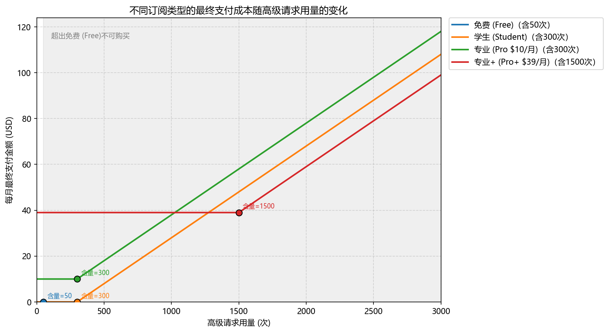

# 会员订阅成本图

这是一个用于展示不同订阅类型在“高级请求”用量变化下，最终每月支付成本的可视化图表。

## 图表说明

- 横坐标：高级请求用量（次）
- 纵坐标：最终每月支付金额（USD）
- 不同颜色：不同订阅方案

当前图中包含以下订阅类型：

- 免费（Free）
- 学生（Student）
- 专业（Pro）
- 专业+（Pro+）

## 最终图片

## 读取方式

如果把这个文件夹作为 GitHub 仓库上传，README 会直接显示上面的图片。请确保图片文件和 `README.md` 保持在同一目录下。

## 仓库内容

- `README.md`：项目说明
- `subscription_costs_chinese_tight.png`：最终图像
